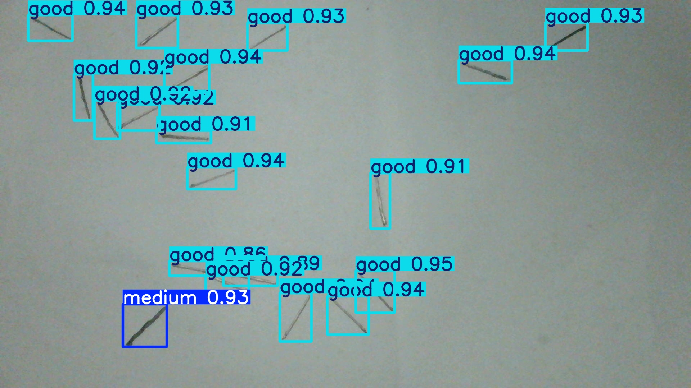
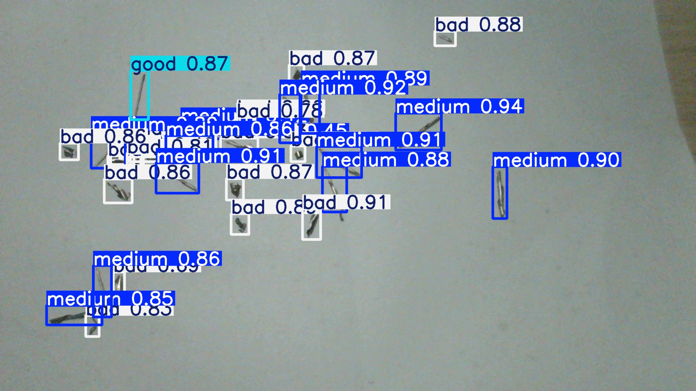

# 实时视觉语言模型系统

基于 **YOLOv8**  和 **Qwen-vl-max** 的实时铁屑检测与分析系统，提供高效的视频流处理和智能分析能力。
---

## 📋 项目概述
本系统集成了计算机视觉和自然语言处理技术，实现对工业铁屑的实时检测和智能分析。采用多线程架构设计，确保界面流畅性和分析准确性。

### 🌟 核心特性
- 🎯 实时目标检测：基于 YOLOv8 的高精度铁屑检测
- 🧠 智能分析：集成 Qwen 视觉语言模型进行深度分析
- ⚡ 多线程架构：异步处理避免界面卡顿
- 📹 视频流处理：支持多种摄像头设备
- 📊 性能监控：实时性能统计和异常监控
- 📝 完善日志：详细的操作日志和错误追踪

---
## 🔧 前置条件
### 系统要求
- 操作系统：Windows 10+ / macOS 10.14+ / Ubuntu 18.04+
- Python 版本：3.8 或更高版本
- 内存：建议 8GB 以上
- 显卡：支持 CUDA 的 NVIDIA 显卡（可选，用于加速）
### 硬件要求
- 摄像头：USB 摄像头或网络摄像头
- 处理器：Intel i5 或同等性能 CPU

---
## **yolov8**模型推理效果





## **yolov8+qwen-vl-max**实时检测效果

<video width="640" height="480" controls>
  <source src="demo.mp4" type="video/mp4">
  您的浏览器不支持视频标签。
</video>


## 🚀 快速开始
### 1️⃣ 环境安装
#### 克隆项目
```
git clone <repository-url>
cd realtime_vlm_system
```
#### 创建虚拟环境（推荐）
```
python -m venv venv
```
#### 激活虚拟环境

##### Windows
```
venv\Scripts\activate
```
##### macOS/Linux
```
source venv/bin/activate
```
#### 安装依赖包
```
pip install -r requirements.txt
```
### 2️⃣ 配置参数
编辑 `config/config.py` 文件，设置以下参数：
- `model_path`：YOLOv8 模型文件路径
- `api_key`：Qwen API 密钥

#### YOLOv8 模型配置
```
MODEL_PATH = "path/to/your/yolov8_model.pt"
```

#### Qwen API 配置
```
QWEN_API_KEY = "your_qwen_api_key_here"
```
#### 摄像头配置
```
CAMERA_INDEX = 0  # 摄像头设备索引
```

#### 分析间隔配置
```
ANALYSIS_INTERVAL = 5  # 秒
```
#### 检测阈值配置
```
CONFIDENCE_THRESHOLD = 0.5
```
### 3️⃣ 运行系统

运行 `main.py` 文件：
```
python main.py
```
系统将自动启动并开始处理视频流，显示检测框和分析结果。

---
## 🏗️ 项目结构
```
realtime_vlm_system/
├── config/              # 配置管理
│   └── config.py        # 主配置文件
├── core/                # 核心功能模块
│   ├── camera_manager.py    # 摄像头管理
│   ├── yolo_detector.py     # YOLOv8 检测器
│   ├── qwen_analyzer.py     # Qwen 分析器
│   └── display_manager.py   # 显示管理器
├── data/                # 数据集目录（用于训练与测试）
│   ├── imgaes/          # 切屑图片目录
|   |   ├── test/        # 训练集图片
|   |   ├── train/       # 验证集图片
|   |   └── valid/       # 测试集图片
|   ├── labels/          # YOLOv8 标签目录
|   |   ├── test/        # 训练集标签
|   |   ├── train/       # 验证集标签
|   |   └── valid/       # 测试集标签
│   └── classes.txt      # YOLOv8 类别文件
├── logs/                # 日志目录
├── models/              # 数据模型
│   └── detection_result.py # 检测结果模型
├── utils/               # 工具模块
│   ├── logger.py        # 日志工具
│   └── performance.py   # 性能监控
├── app.py               # 主应用程序
├── demo.mp4             # 演示视频
├── LICENSE              # 项目许可证
├── main.py              # 程序入口
├── README.md            # 项目说明
├── README_EN.md            # 项目说明
└── requirements.txt     # 依赖包列表

```

---
## ⚙️ 配置说明

| 参数 | 说明 | 默认值 | 备注 |
| --- | --- | --- | --- |
`MODEL_PATH` | YOLOv8模型文件路径 | - | 必须配置
`CAMERA_INDEX` | 摄像头设备索引 | 0 | 通常为 0 或 1
`ANALYSIS_INTERVAL` | Qwen分析间隔 | 5 | 单位：秒
`QWEN_API_KEY` | Qwen API 密钥 | - | 必须配置
`CONFIDENCE_THRESHOLD` | 检测置信度阈值 | 0.5 | 0.0-1.0
`DISPLAY_SCALE` | 显示缩放比例 | 0.8 | 0.1-0.2

---

## 🎮 使用说明
1. **启动程序**：运行 `python main.py`
2. **实时检测**：系统自动开始视频流处理和目标检测
3. **智能分析**：每隔设定时间自动调用 Qwen 进行分析
4. **查看结果**：在显示窗口查看检测框和分析结果
5. **退出程序**：按 `q` 键或关闭窗口

### 🖱️ 交互操作
- `q` **键**：退出程序
- `s` **键**：保存当前帧图像
- `p` **键**：暂停/恢复检测
- `r` **键**：重置性能统计

---
## 🚦 性能优化
### 优化策略
- 多线程处理：检测、分析、显示分离执行
- 智能队列管理：仅处理最新帧，避免积压
- 内存优化：及时释放图像缓存
- GPU 加速：支持 CUDA 加速推理

### 性能调优建议
- 降低输入分辨率提升检测速度
- 调高置信度阈值减少误检
- 增大分析间隔降低 API 调用频率
- 关闭不必要的显示功能
---

## 🛠️ 故障排查
### 常见问题及解决方案
| 问题现象 | 可能原因 | 解决方法 |
| --- | --- | --- |
| 摄像头无法打开 | 设备占用/驱动问题 | 检查设备管理器，更新驱动 |
| 模型加载失败 | 路径错误/文件损坏 | 验证模型文件路径和完整性 |
| API 调用超时 | 网络问题/密钥错误 | 检查网络连接和 API 密钥 |
| 检测精度低 | 阈值设置不当 | 调整置信度阈值参数 |
| 程序运行卡顿 | 性能瓶颈 | 降低分辨率，优化参数配置 |
---

## 📝 日志系统
### 日志类型
- INFO：正常操作记录
- WARNING：警告信息
- ERROR：错误信息
- DEBUG：调试信息
### 日志位置
- 控制台输出：实时显示重要信息
- 文件日志：保存在 `logs/` 目录下
- 性能日志：`logs/performance.log`
- 错误日志：`logs/error.log`
---
## 🙏 免责声明
本项目仅供学习和研究使用，开发者不对任何因使用本项目而导致的损失承担责任。包括：

- **YoloV8**
- **qwen-vl-max**
- **Python-OpenCV**

---

## 📜 开源协议
此项目采用 MIT 许可证，详情请查看 [MIT License](LICENSE)文件。

---

## 📝 版本信息
### v1.0.0
- 初始版本，基础功能实现

---

# 如果您喜欢此项目，请点击星星⭐！！！

