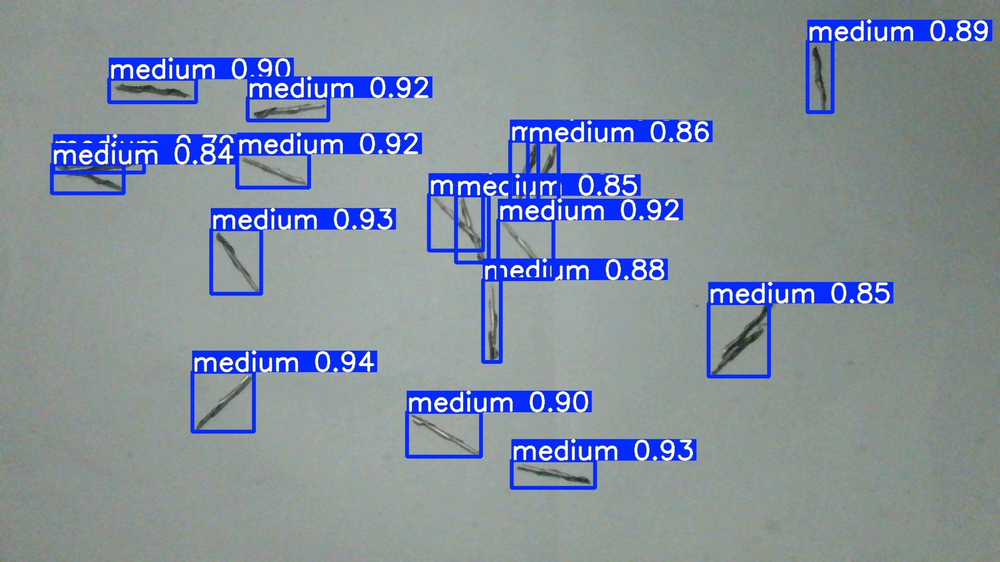
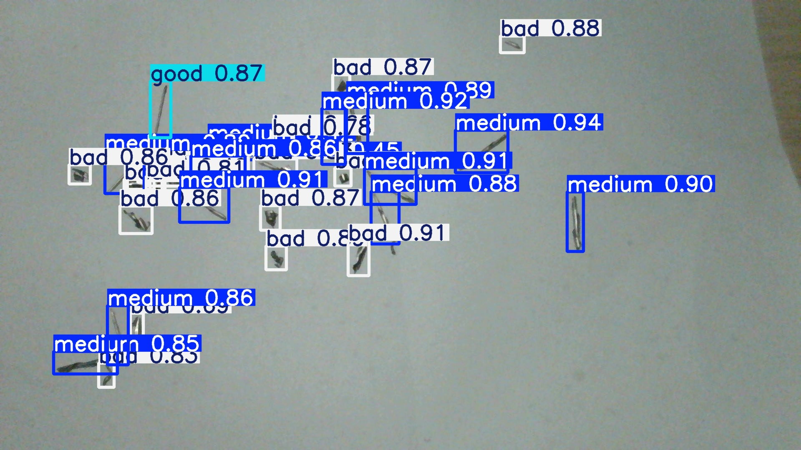
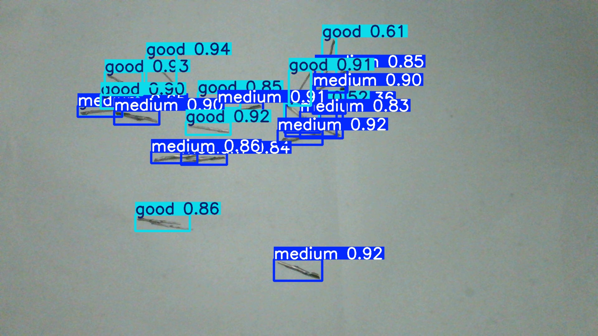

# Real-Time Vision-Language Model System

A real-time swarf detection and analysis system based on **YOLOv8** and **Qwen-vl-max**, providing efficient video stream processing and intelligent analysis capabilities.
---

## 📋 Project Overview
This system integrates computer vision and natural language processing technologies to achieve real-time detection and intelligent analysis of industrial swarf. It adopts a multi-threaded architecture to ensure smooth interface performance and analysis accuracy.

### 🌟 Key Features
- 🎯 Real-time Object Detection: High-precision swarf detection based on YOLOv8
- 🧠 Intelligent Analysis: Integrated Qwen vision-language model for deep analysis
- ⚡ Multi-threaded Architecture: Asynchronous processing to avoid UI lag
- 📹 Video Stream Processing: Supports various camera devices
- 📊 Performance Monitoring: Real-time performance statistics and anomaly monitoring
- 📝 Comprehensive Logging: Detailed operation logs and error tracking

---
## 🔧 Prerequisites
### System Requirements
- Operating System: Windows 10+ / macOS 10.14+ / Ubuntu 18.04+
- Python Version: 3.8 or higher
- Memory: Recommended 8GB or more
- GPU: NVIDIA GPU with CUDA support (optional, for acceleration)
### Hardware Requirements
- Camera: USB camera or network camera
- Processor: Intel i5 or equivalent CPU

---
## **yolov8** Model Inference Results





## **yolov8+qwen-vl-max** Real-Time Detection Results


https://github.com/user-attachments/assets/5998caef-f943-4f75-b11e-28352f8acc03


## 🚀 Quick Start
### 1️⃣ Environment Setup
#### Clone the Project

```
git clone https://github.com/rtll666/realtime_vlm_system.gi
cd realtime_vlm_system
```
#### Create Virtual Environment (Recommended)

```
python -m venv venv
```
#### Activate Virtual Environment

##### Windows

```
venv\Scripts\activate
```
##### macOS/Linux
```
source venv/bin/activate
```
#### Install Dependencies

```
pip install -r requirements.txt
```
### 2️⃣ Configure Parameters
Edit the `config/config.py` file to set the following parameters:
- `model_path`: YOLOv8 model file path
- `api_key`: Qwen API key

#### YOLOv8 Model Configuration

```
MODEL_PATH = "path/to/your/yolov8_model.pt"
```


#### Qwen API Configuration

```
QWEN_API_KEY = "your_qwen_api_key_here"
```
#### Camera Configuration

```
CAMERA_INDEX = 0  # 摄像头设备索引
```


#### Analysis Interval Configuration

```
ANALYSIS_INTERVAL = 5  # 秒
```
#### Detection Threshold Configuration

```
CONFIDENCE_THRESHOLD = 0.5
```
### 3️⃣ Run the System

Run the `main.py` file:

```
python main.py
```
The system will automatically start and begin processing the video stream, displaying detection boxes and analysis results.

---
## 🏗️ Project Structure

```
realtime_vlm_system/
├── config/              # Configuration management
│   └── config.py        # Main configuration file
├── core/                # Core functional modules
│   ├── camera_manager.py    # Camera manager
│   ├── yolo_detector.py     # YOLOv8 detector
│   ├── qwen_analyzer.py     # Qwen analyzer
│   └── display_manager.py   # Display manager
├── data/                # Dataset directory (for training and testing)
│   ├── imgaes/          # Swarf image directory
|   |   ├── test/        # Training set images
|   |   ├── train/       # Validation set images
|   |   └── valid/       # Test set images
|   ├── labels/          # YOLOv8 label directory
|   |   ├── test/        # Training set labels
|   |   ├── train/       # Validation set labels
|   |   └── valid/       # Test set labels
│   └── classes.txt      # YOLOv8 class file
├── logs/                # Log directory
├── models/              # Data models
│   └── detection_result.py # Detection result model
├── utils/               # Utility modules
│   ├── logger.py        # Logging utility
│   └── performance.py   # Performance monitoring
├── app.py               # Main application
├── demo.mp4             # Demo video
├── LICENSE              # Project license
├── main.py              # Program entry point
├── README.md            # Project documentation
├── README_EN.md         # Project documentation
└── requirements.txt     # Dependency list


```


---
## ⚙️ Configuration Description

| Parameter | Description | Default Value | Notes |
| --- | --- | --- | --- |
`MODEL_PATH` | YOLOv8 model file path | - | Required
`CAMERA_INDEX` | Camera device index | 0 | Usually 0 or 1
`ANALYSIS_INTERVAL` | Qwen analysis interval | 5 | In seconds
`QWEN_API_KEY` | Qwen API key | - | Required
`CONFIDENCE_THRESHOLD` | Detection confidence threshold | 0.5 | 0.0-1.0
`DISPLAY_SCALE` | Display scaling ratio | 0.8 | 0.1-0.2

---

## 🎮 Usage Instructions
1. **Start the Program**: Run `python main.py`
2. **Real-Time Detection**: The system will automatically start video stream processing and object detection
3. **Intelligent Analysis**: Qwen will be invoked for analysis at the set interval
4. **View Results**: View detection boxes and analysis results in the display window
5. **Exit the Program**: Press `q` or close the window

### 🖱️ Interactive Operations
- `q` **Key**: Exit the program
- `s` **Key**: Save the current frame image
- `p` **Key**: Pause/Resume detection
- `r` **Key**: Reset performance statistics

---
## 🚦 Performance Optimization
### Optimization Strategies
- Multi-threaded Processing: Separate execution of detection, analysis, and display
- Smart Queue Management: Only process the latest frame to avoid backlog
- Memory Optimization: Release image cache in time
- GPU Acceleration: Support CUDA accelerated inference

### Performance Tuning Suggestions
- Lower input resolution to speed up detection
- Increase confidence threshold to reduce false positives
- Increase analysis interval to reduce API call frequency
- Disable unnecessary display features
---

## 🛠️ Troubleshooting
### Common Issues and Solutions
| Issue | Possible Cause | Solution |
| --- | --- | --- |
| Unable to open camera | Device occupied/driver issue | Check Device Manager, update drivers |
| Model loading failure | Path error/corrupted file | Verify model file path and integrity |
| API call timeout | Network issue/key error | Check network connection and API key |
| Low detection accuracy | Improper threshold setting | Adjust confidence threshold parameter |
| Program lagging | Performance bottleneck | Lower resolution, optimize parameter settings |
---

## 📝 Logging System
### Log Types
- INFO: Normal operation records
- WARNING: Warning information
- ERROR: Error information
- DEBUG: Debug information
### Log Locations
- Console Output: Real-time display of important information
- File Logs: Stored in the `logs/` directory
- Performance Logs: `logs/performance.log`
- Error Logs: `logs/error.log`
---
## 🙏 Disclaimer
This project is for learning and research purposes only. The developers are not responsible for any losses caused by the use of this project. Including:

- **YoloV8**
- **qwen-vl-max**
- **Python-OpenCV**

---

## 📜 Open Source License
This project is licensed under the MIT License. For details, please see the [MIT License](LICENSE) file.

---

## 📝 Version Information
### v1.0.0
- Initial version with basic functionality

---

# If you like this project, please give it a ⭐ star!!!


